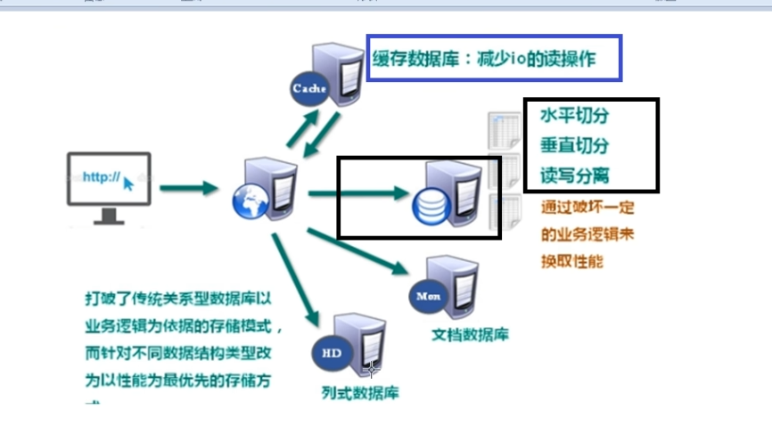
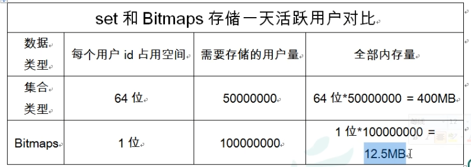
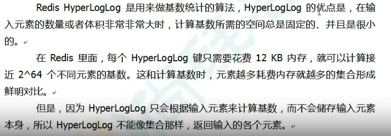
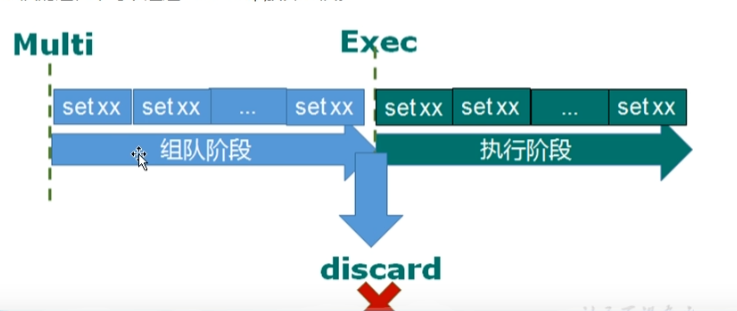
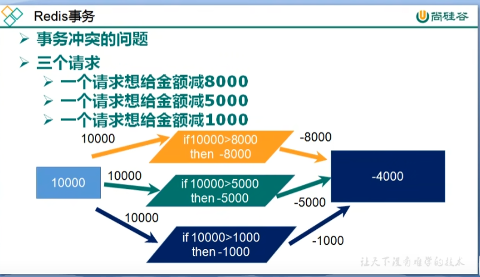
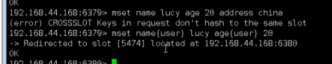

# Redis缓存

IO压力

服务器做集群或者分布式部署，在服务器前加负载均衡nginx。

出现session问题？session该如何存储？

1.存储到客户端cookie，安全性有问题

2.session复制，空间浪费

3.nosql数据库，完全可以存到内存中，速度快，缓解CPU和IO压力，并且可以作为缓存使用提高访问速度，减少IO的读操作



## 1.NoSQL数据库

### 1.1 概述

**非关系性的数据库**

不依赖业务逻辑方式存储，而是以简单的key-value模式存储。大大的增加了 数据库的拓展能力。

- > **不遵循SQL标准。**

- > **不支持ACID。**

- > **远超于SQL的性能。**

### 1.2 适用场景

- **对数据高并发读写**
- **海量数据读写**
- **对数据高可拓展行**

### 1.3 不适用场景

需要事务支持

基于sql结构化查询，处理复杂的关系，需要即席查询

### 1.4

行式数据库，列式数据库

## 2. Redis概述安装

### 2.1概述

- 开源的键值存储系统
- 除k-v的类型，还支持存储的类型有 string，list，set，zset(sorted set有序集合)和hash（哈希类型）
- 这些数据类型都支持push/pop,add/remove及取交集并集和差集及更丰富的操作，这些操作都是**原子性**的。

- 在此基础上，Redis支持各种不同方式的**排序**
- 为了保证效率，数据都是**缓存在内存**中
- Redis会**周期性**的把更新的**数据写入磁盘**或者把修改操作写入追加的写录文件。
- 在此基础上实现**主从同步**

### 适用场景


### 2.2后台启动

redis-server /etc/redis.conf

redis-cli :关闭 shutdown或者杀掉进程号

### 2.3 相关知识

端口 6379

默认16个数据库，默认使用0号库

使用 select <dbid> 来切换数据库比如 select 8

统一密码管理，所有库同样密码

**dbsize** 查看当前数据库的key的数量

**flushdb** 清空当前库

**flushal**l 通杀全部库


redis是单线程+多路IO复用技术

与memcache三点不同，支持多数据类型，支持持久化，单线程+多路IO复用 

## 3 常用五大数据类型

### 3.1 Redis键（key）

keys *查看当前库所有key（匹配：key *1）

exists key 	判断某个key是否存在

type key 	查看你的key是什么类型

del key  	删除指定的key数据

unlink key 根据value选择非阻塞删除

仅将keys从keyspace元数据中删除，真正的删除会在后续异步操作

**expires key 10** 	10秒钟：为给定的key设置过期时间

ttl key 	查看还有多少秒过期，-1表示永不过期，-2表示已过期


select 	命令切换数据库

dbsize 	查看当前数据库的key的数量

flushdb	清空当前库

flushall	通杀全部库


### 3.2 字符串

#### 1. 简介

string 是二进制安全的，意味着redis的string可以包含任何数据，比如jpg图片，或者序列化对象。

string类型 是redis最基本的数据类型，一个redis中字符串value最多可以是**512M**

#### 2.常用命令

set <key> <value> 添加键值对		覆盖

get <key> 查询对应键值

append <key><value>将给定的<value>追加到原值的末尾

strlen <key>获取值的长度

setnx <key> <value> 只有在key不存在时 	设置key的值


incr <key> 

​				将key中储存的数字值增1

​				只能对数字值操作，如果为空，新增值为1

decr <key>

​				将key中储存的数字值减1

​				只能对数字值操作，如果为空，新增值为-1

incrby / decrby <key> <步长> 将key中存储的数字值增减。自定义步长

-----------------------------------------------------------------------------------------------------------------------------

##### 原子性

INCR KEY		时间复杂度O1

所谓原子操作是指不会被线程调度机制打断的操作；

这种操作一旦开始，就一直运行到结束，中间不会有任何context switch（切换到另一个线程）。

（1）在单线程中，能够在单条指令中完成的操作都可以认为是“原子操作”，因为终端只能发生于指令之间

（2）在多线程中，不能被其他线程（进程）打断的操作就叫原子操作。

Redis单命令的原子性主要得益于Redis的单线程。

-----------------------------------------------------------------------------------------------------------------------------

mset <key1><value1><key2><value2>...

同时设置一个或者多个key-value对

mget <key1><key2><key3>......

同时获取一个或者多个value

msetnx <key1><value1><key2><value2>.....

同时设置一个或者多个key-value对，当且仅当所有给定的key都不存在。

原子性，有一个失败则都失败

getrange <key><起始位置><结束位置>

获得值的范围，类似java中的substring，**前包，后包**

setrange <key><起始位置><value>

用<value>覆写<key>所储存的字符串值，从<起始位置>开始（**索引从0开始**）


setex <key><过期时间><value>

设置键值的同时，设置过期时间，单位秒

getset <key><value>

以新换旧，设置了新值同时获取旧值。

#### 3 数据结构

string的数据结构为简单的动态字符串SDS，是可以修改的字符串。采用预分配冗余空间的方式来减少内存的频繁分配。

### 3.3 List列表

**单键多值**

底层是一个双向链表。对两端的操作性能很高，通过索引下标的操作中间的节点性能会较差。

#### 1. 常用命令

lpush/rpush <key><value1><value2><value3>...从左边/右边插入一个或者多个值。

lpop/rpop <key> 从左边/右边吐出一个值。**值在健在，值光键亡。**


rpoplpush <key1><key2> 从<key1>列表右边吐出一个值，插到<key2>列表左边。


lrange <key><start><stop>

按照索引下标获得元素（从左到右） 

lrange mylist 0 -1 0左边第一个，**-1右边第一个，（0-1表示获取所有）**

lindex <key><index>按照索引下标获取元素（从左到右）

llen <key> 获取列表长度


linsert <key> before /after <value><newvalue> 在<value>的前/后面插入<newvalue>插入值

lrem <key><n><value>从左边删除n个value（从左到右）

lset <key><index><value>将列表key下标为index的值替换成value


#### 2.数据结构

   快速链表，quicklist

首先在列表元素较少的情况下会使用一块连续的内存存储，这个结构是ziplist，也即是压缩列表。

它将所有元素紧挨者一起存储，分配的是一块连续的内存。

当数据量比较多的时候才会改成quicklist。

 因为普通的链表需要的附加指针空间太大，会比较浪费空间。

Redis将链表和ziplist结合起来组成了quicklist，也就是将多个ziplist使用双向指针串起来使用。这样既满足了快速的插入删除性能，也不会初夏太大的空间冗余。

### 3.4 set集合

类似list，特殊之处在与set可以**自动排重**

Redis的set是string类型的**无序集合，它底层其实是一个value为null的hash表**，所以可以添加，删除，查找的**复杂度都是O(1)**

#### 1.常用命令

sadd <key><value1><value2>...

将一个或者多个member元素加入到集合key中，已经存在member元素将被忽略

smember <key>取出该集合的所有值

sismember <key><value>判断集合<key>是否为含有该<value>的值，有1，没有0

scard <key>返回该集合的元素个数

srem <key><value1><value2>... 删除集合中的某个元素

spop <key> **随机从该集合中吐出一个值。**

srandmember <key><n> 随机从该集合中取出n个值。不会从集合中删除。

smove <source><destination>value 把集合中一个值从一个集合移动到另一个集合

sinter <key1><key2>返回两个集合的**交集**元素

sunion <key1><key2> 返回两个集合的**并集**元素

sdiff <key1><key2> 返回两个集合的**差集**元素（key1中的，不包括key2中的）

#### 2. 数据结构

底层为dict字典，字典是用哈希表实现的。

内部使用hash结构，所有的value都指向同一个内部值。

### 3.5 Hash 哈希

Redis hash是一个键值对集合

Redis hash是一个string类型的**field**和**value**的映射表，hash特别适合用于存储对象。

#### 1.常用命令

hset <key><field><value> 给<key>集合中的 <field>健赋值<value>

hget <key1><field>从<key1>集合<field>取出value

hmset <key1><field1><value1><field2><value2>...批量设置hash的值

hexists<key1><field> 查看哈希表key中，给定的field是否存在

hkeys <key> 列出该hash集合的所有field

hvals <key>列出该hash集合的所有value

hincrby <key><field><increment>为哈希表key中的域field的值加上增量1 -1

hsetnx <key><field><value>将哈希表key中的域field的值设置为value，当且仅当域field不存在

#### 2.数据结构

ziplist压缩列表，hashtable哈希表

当field-value长度较短且个数较少时，使用ziplist，否则使用hashtable 

### 3.6 有序集合

和普通集合set非常相似，是一个**没有重复元素**的字符串集合。

不同之处是，有序集合的每个成员都关联了一个**评分(score)**，这个评分(score)被用来按照从最低分到最高分的方式排序集合中的成员。**集合的成员是唯一的，但评分可以是重复了。**

可以很快的根据评分(score)或者次序(position)来获取一个范围的元素

访问有序集合的中间元素也很快，因此能够使用有序集合作为一个没有重复成员的智能列表。

#### 1.常用命令

zadd <key><score1><value1><score2><value2>...

将一个或多个member元素及其score值加入到有序集key当中

**zrange <key><start><stop> [WITHSCORES]**

返回有序集key中，下标在<start><stop>之间的元素

带WITHSCORES，可以让分数一起和值返回到结果集

zrangebyscore key minmax [withscores] [limit offset count]

返回有序集key中，所有score值介于min和max之间（包括等于min或max）的成员。

有序集成员按score值递增(从小到大)次序排列

z**rev**rangebyscore key **maxmin** [withscores] [limit offset count]

同上，改为从大到小排列

zincrby <key><increment><value>    为元素的score加上增量

zrem <key><value> 删除该集合下，指定值的元素

zcount <key><min><max> 统计该集合，分数区间内的元素个数

zrank <key><value>返回该值在集合中的排名，从0开始

#### 2数据结构

1）hash，hash的作用就是关联元素value和权重score，保障元素value的唯一性，可以通过元素value找到相应的score值。

2）跳跃表，跳跃表的目的地在于给元素value排序，根据score的范围获取元素列表

## 4.redis配置文件

只支持bytes，不支持bits，大小写不敏感

## 5.发布，订阅

Redis发布订阅(pub/sub)是一种消息通信模式：发送者(pub)发送消息，订阅者(sub)接受消息。

Redis客户端可以订阅任意数量的频道。

### 命令行实现

#### 1.打开一个客户端订阅channel1

SUBSCRIBE channel1

#### 2.打开另一个客户端，给channel1发布消息hello

publish channel1 hello 

返回的是订阅这数量

#### 3.打开第一个客户端可以看到发送的消息

## 6.Redis6新数据类型

### 6.1 Bitmaps

Redis提供了Bitmaps这个“数据类型”可以实现对位的操作：

1）Bitmaps本身不是一种数据类型，实际上它就是字符串（key-value），但是它可以对字符串的位进行操作。

2）Bitmaps单独提供了一套命令，所以在Redis中使用Bitmaps和使用字符串的方法不太相同。可以吧Bitmaps想象成一个以位为单位的数组，数组的每个单位只能存储0和1，数组的下标在Bitmaps中叫做偏移量。

#### 命令

##### 1、setbit

setbit <key><offset><value>设置Bitmaps中某个偏移量的值（0或1）offest：偏移量从0开始。

在第一次初始化Bitmaps时，假如偏移量很大，那么整个初始化过程执行会比较慢，可能会造成Redis的阻塞。

##### 2、getbit

getbit <key><offset> 获取Bitmaps中某个偏移量的值

获取键的第offset位的值（从0开始算）

##### 3、bitcount

bitcount <key>[start end]统计字符串从start字节到end字节比特值为1的数量、

统计字符串被设置为1的bit数。

##### 4、bitop

bitop and(or/not/xor) <destkey> [key...]

bitop是一个复合操作，它可以做多个Bitmaps的and（交集），or（并集），not（非），xor（异或）操作并将结果保存在destkey中。

#### Bitmaps和set对比

Bitmaps相较于set极大节省空间



如果活跃用户较少，那么set占得空间更少

### 6.2 HyperLogLog

基数问题

基数：比如数据集{1,3,5,7,5,7,8}，那么这个数据集的基数集{1,3,5,7,8}，基数(不重复的元素)为5.基数估计就是在误差可接受的范围内，快速计算基数。




#### 命令

##### 1、pfadd

pfadd <key><element>[element...] 添加指定元素到HyperLogLog中

如果执行命令后HLL估计的近似基数发生变化，则返回1，否则返回0

##### 2、pfcount

pfcount <key> [key...] 计算HLL的近似基数

可以计算多个HLL，比如用HLL存储每天的UV，计算一周的UV可以使用7天的UV合并计算即可

##### 3、pfmerge

pfmerge <destkey><sourcekey>[sourcekey...]将一个或者多个HLL合并后的结果存储在另一个HLL中，比如每月活跃用户可以使用每天的活跃用户来合并计算可得。

###  6.3 Geospatial

GEO地理信息的缩写，就是元素的二维坐标 。

#### 命令

##### 1、geoadd

geoadd <key><longitudu><latitude><member> [longitude latitude ]

##### 2、geopos

geopos <key><member>[member...] 获得指定地区的坐标值

##### 3、geodist

geodist <key><member1><member2> [m|km|ft|mi] 获取两个位置之间的直线距离

##### 4、georadius

georadius <key><longitude><latitude> radius m|km|ft|mi 以给定的经纬度为中心，找出某一半径内的元素


## 7.Jedis

systemctl status firewalld  Linux查看防火墙

systemctl stop firewalld 关闭防火墙

## 8.事务和锁机制

### 8.1Redis事务定义

Redis事务是一个单独的隔离操作：事务中所有的命令都会序列化、按顺讯地执行。事务在执行的过程中，不会被其他客户端发送来的命令请求所打扰。

Redis事务的主要作用就是 **串联多个命令**防止别的命令插队。

### 8.2 Multi、Exec、discard

输入Multi命令，开始事务，输入的命令会依次进入命令队列中，但不会执行，直到输入Exec，Redis会将之前的命令队列中的命令依次执行。

组队过程中可以通过discard来放弃组队。



### 8.3 错误处理

组队中某个命令出现了报告错误，执行时整个的所有队列都会被取消。

如果执行阶段某个命令报出了错误，则只有报错的命令不会被执行，而其他的命令都会执行，不会回滚。

### 8.4 为什么要做成事务


### 8.5 事务冲突的问题

#### 8.5.1 例子



#### 8.5.2 悲观锁


**悲观锁**（pessimistic lock）：每次去拿数据的时候都认为别人会修改，所以每次在拿数据的时候都会上锁，这样别人想拿这个数据就会block直到它拿到锁。 **传统关系型数据库里面就用到了很多这种锁机制**，比如**行锁，表锁**等，**读锁，写锁**等，都是在做操作之前先上锁。

缺点效率低

#### 8.5.3 乐观锁


 

**乐观锁（optimistic Lock）**，每次去拿数据都认为别人不会修改，所以不会上锁，但是更新的时候会判断一下在此期间别人有没有去更新这个数据，可以使用版本号等机制。**乐观锁适用于多读的应用类型，这样可以提高吞吐量。Redis就是利用这种check-and-set机制实现事务的。**

#### 8.5.4 WATCH key [key...]

在执行multi之前，先执行watch key1 [key2]，可以监视一个或者多个key，如果在事务**执行之前这个（或这些）key被其他命令所改动，那么事务将被打断。**

#### 8.5.5 unwatch

取消watch命令对所有key的监视。

如果执行watch命令之后，exec命令或discard命令先被执行了的话，那么就不需要在执行unwatch了。

### 8.6 Redis事务三特性

#### 单独的隔离操作

事务中的所有命令都会被序列化、按顺序地执行。事务在执行过程中，不会被其他客户端发来的命令请求所打断。

#### 没有隔离级别的概念

队列中的命令没有提交之前都不会实际被执行，因为事务提交前任何指令都不会被实际执行。

#### 不保证原子性

事务中如果有一条命令执行失败，其后的命令仍然会被执行，没有回滚。

## 9.Redis事务秒杀案例

### 并发问题：

### 超买问题

利用乐观锁解决

### 连接超时问题

通过连接池解决

### 库存遗留问题

乐观锁造成的库存遗留问题

解决：LUA脚本

#### LUA脚本在Redis中的优势

将复杂的或者多步的redis操作，写为一个脚本，一次提交给redis执行，减少反复连接redis的次数，提升性能。

LUA脚本是类似redis事务，有一定的原子性，不会被其他命令插队，可以完成一些redis事务性的操作。

但是注意redis的lua脚本功能，只有在redis2.6以上的版本才可以使用。

利用lua脚本淘汰用户，解决超卖问题。

redis2.6版本以后，利用lua脚本解决**争抢问题**，实际上是**redis利用其单线程的特性，用任务队列的方式解决多任务并发问题。**

## 10. Redis持久化之RDB（Redis DataBase）

Redis提供了两个不同形式的持久化方式。

RDB（Redis DataBase）

AOF（Append Of File）

### 10.1 是什么

在指定的**时间间隔**内将内存中的数据集**快照**写入磁盘，也就是Snapshot快照，它恢复时是将快照文件直接读到内存里。

### 10.2 备份是如何执行的

Redis会单独创建(fork)一个子进程来进行持久化，会**先**将数据**写**入到一个**临时文件**中，待持久化过程都结束了，在用这个**临时文件替换上次持久化好**的文件。整个过程中，主进程是不进行任何IO操作的，这就确保了极高的性能，如果需要进行大规模数据的恢复，且对于数据恢复的完整性不是非常敏感，那RDB方式要比AOF方式更加的高效。

**RDB的缺点是*最后一次持久化后的数据可能丢失。***

### 10.3 dump.rdb文件

在redis.conf中配置文件名称，默认为dump.rdb

##### stop-writes-on-bgsave-error: 当redis无法写入磁盘的话，直接关掉Reids的写操作，推荐yes

##### rdbcompression：压缩文件

对于存储到磁盘中的快照，可以设置是否进行压缩存储，如果是的话，redis会采用**LZF算法**进行压缩。

##### rdbchecksum：检查完整性

在存储快照后，还可以让redis使用CRC64算法来进行数据校验

##### save： 

格式：save 秒钟 写操作次数

RDB是整个内存的压缩过的Snapshot，RDB的数据结构，可以配置符合的快照触发条件，

**默认是一分钟内改了1万次，或5分钟内改了10次，或者15分钟内改了1次。**

**禁用**

**不设置save指令**，或者**给save传入空字符串**

##### save vs bgsave

save：只管保存，其他不管，全部阻塞，手动保存，不建议

**bgsave：Redis会在后台异步进行快照操作，快照同时还可以响应客户端请求。**

可以通过lastsave命令获取最后一次成功执行快照的时间

### 10.4 优势

- 适合大规模的数据恢复
- 对数据完整性和一致性要求不高更合适使用
- **节省磁盘空间**
- **恢复速度快**

### 10.5 缺点

- Fork的时候，内存中的数据被克隆了一份，大致2倍的膨胀性需要考虑
- **虽然Redis在fork时使用了*写时拷贝技术*，但是如果数据庞大时还是比较消耗性能。**
- **在备份周期在一定间隔时间做一次备份，所以如果Redis意外down掉的话，就会丢失最后一次快照后的所有修改。**

### 10.6 备份

## 11.Redis持久化之AOF（Append Only File）

### 11.1 是什么

**以日志的形式来记录每个写操作（增量保存）**，将Redis执行过的所有写指令记录下来(**读操作不记录**)，**只许追加文件但不可以改写文件**，redis启动之处会读取该文件重新构建数据，换言之，redis重启的话就根据日志文件的内容将写指令从前到后执行一次已完成数据的恢复工作。

### 11.2 AOF持久化流程

1）客户端的请求写命令会被append追加到AOF缓冲区内；

2）AOF缓冲区根据AOF持久化策略[always, everysec,no]将操作sync同步到磁盘的AOF文件中；

3）AOF文件大小超过重写策略或手动重写时，会对AOF文件rewrite重写，压缩AOF文件容量；

4）Redis服务重启时，会重新load加载AOF文件中的写操作达到数据恢复的目的；

## 12. Redis主从复制

### 12.1 是什么

主机数据更新后根据配置和策略，自动同步到备机的**master/slaver机制，Master以写为主，slave以读为主**

### 12.2 能干嘛

- 读写分离，性能拓展
- 容灾快速恢复


集群


### 12.3 如何配置

拷贝多个redis.conf 文件include（写绝对路径）

**开启daemonize yes**

Pid文件名字 pidfile

指定端口port

**Log文件名字**

dump.rdb名字dbfilename

**Appendonly 关掉或者换掉名字**

------

1、创建/myredis文件夹

2、复制redis.conf配置文件到文件夹中

关闭redis.conf中AOF

3、配置一主两从，创建三个配置文件

- redis6379.conf
- redis6380.conf
- redis6381.conf

4、在三个配置文件写入内容

```shell
include /myredis/redis.conf
pidfile /var/run/redis_6379.pid
port 6379
dbfilename dump6379.rdb
```

类似的其他文件

5、启动三个redis服务

```shell
redis-server redis6379.conf
redis-server redis6380.conf
redis-server redis6381.conf
```

#### 12.3.1 查看三台主机运行情况

info replication

打印主从复制的相关信息

##### **通过端口号连接**

```
redis-cli -p 6379
```

#### 12.3.2 配从(库)不配主(库)

slaveof <ip> <port>

成为某个实例的从服务器

1、在6380和6381上执行：slaveof 127.0.0.1 6379

2、在主机上写，在从机上可以读取数据

3、主机挂掉，重启就行，一切如初

4、从机重启需重设：slaveof 127.0.0.1 6379

可以将配置增加到文件中。永久生效。

### 12.4 典型问题

#### 12.4.1 一主二仆

如果一个从服务器挂掉，在这期间主服务器进行写操作，从服务器重启后，是可以得到全部数据的。（全量复制）

如果主服务器挂掉，从服务器仍未从服务器

#### 12.4.2 薪火相传

上一个slave可以是下一个slave的master，slave同样可以接受其他slaves的连接和同步请求，那么该slave作为了链条中的下一个master，可以有效减轻master的写压力，去中心化降低风险。

### 12.4.3 反客为主

当一个master宕机后，后面的slave可以立刻升为master，其后面的slave不用做任何修改

用slaveof no one 将从机变成主机

### 12.5 复制原理


1、当从服务器连接主服务器之后，从服务器向主服务器发送进行数据同步消息。

2、主服务器接到从服务器发送过来同步消息，把主服务器数据进行持久化，rdb文件，把rdb文件发送给从服务器，从服务器拿到rdb进行读取。

3、每次主服务器进行写操作之后，和从服务器进行数据同步

------

slave 启动成功连接到master后会发送一个sync命令。

master接到命令启动后台的存盘进程，同时搜集所有接收到的用于修改数据集命令，在后台进程执行完毕后，master将传送整个数据文件到slave，以完成一次完全同步。

全量复制：而slave服务在接收到数据库文件数据后，将其存盘并加载到内存中。

增量复制：master继续将新的所有收集到的修改命令一次传给slave，完成同步

但是只要是重新连接master，一次完全同步（全量复制）将被自动执行。

### 12.6 哨兵模式

#### 12.6.1 是什么

**反客为主的自动版**，能够后台监控主机是否故障，如果故障了根据投票数自动将从库转换为主库。

#### 12.6.2 实现步骤

1、调整为一主二仆模式，63079带着6380，6381

2、自定义的/myredis目录下新建sentinel.conf文件，名字不能错

3、配置哨兵，填写内容

sentinel monitor mymaster 127.0.0.1.6379 1

其中mymaster为监控对象起的服务器名称，1 为至少有多少个哨兵同意迁移的数量

4、启动哨兵

/usr/local/bin

redis做压测可以使用自带的**redis-benchmark**工具

执行 redis-sentinel /myredis/sentinel.conf

#### 12.6.2.1 当主机挂掉，从机选举中产生新的主机

根据优先级别：slave-priority

原主机重启后会变为从机。

#### 12.6.2.2 复制延时

由于所有的写操作都是现在master上操作，然后同步更新到slave上，所以master同步到slave机器有一定延迟，当系统很繁忙的时候，延迟问题会更加严重，slave机器数量的增加也会使这个问题更加严重。


优先级在redis.conf中默认：slave-priority 100/replica-priority 100，值越小优先级越高

偏移量是指获取原主机数据最全的

每个redis实例启动后都会随机生成一个40位的runid

## 13. 集群

### 13.1问题

容量不够，redis如何进行扩容？

并发写操作，redis如何分摊？

**另外，主从模式，薪火相传模式，主机宕机，导致ip地址发生变化，应用程序中配置需要修改相应的主机地址、端口等信息。**

早期通过代理主机来解决，但是redis3.0中提供了结局方案。就是**无中心化集群配置**

### 13.2什么是集群

redis集群实现了对redis的水平扩容，即启动N个redis节点，将整个数据库分布存储在这N个节点中，每个节点存储总数据的1/N。

redis集群通过分区(partition)来提供一定程度的可用性(availablity)：即使集群中有一部分节点失效或者无法进行通讯，集群也可以继续处理命令请求。

### 13.3 删除持久化数据

将rdb，aof文件都删除掉

### 13.4 制作6个实例，6379,6380,6381,6389,6390,6391

#### 13.4.1 配置基本信息

开启daemonize yes

**Pid文件名字**

**指定端口**

Log文件名字

**Dump.rdb 名字**

Appendonly 关掉或者换名字

#### 13.4.2 Redis cluster配置修改

cluster-enabled **yes** 打开集群模式

cluster-config-file **nodes-6379.conf** 设定节点配置文件名

cluster-node-timeout **15000** 设定节点失联时间，超过改时间（毫秒），集群自动进入主从切换

```shell
include /home/bigdata/redis.conf
pidfile /var/run/redis_6379.pid
port 6379
dbfilename dump6379.rdb
dir /home/bigdata/redis_cluster
logfile /home/bigdata/redis_cluster/redis_err_6379.log
cluster-enabled yes
cluster-config-file nodes-6379.conf
cluster-node-timeout 15000
```

%s/6479/6380 将所有的6379改成6380

#### 13.4.3 启动6个redis服务

### 13.5 将六个节点合成一个集群

组合之前，请**确保所有的redis实例启动**后，nodes-xxxx.conf文件都生成正常。

- 合并

  **cd /opt/redis-x.x.x/src**目录下  

```shell
redis-cli --cluster create --cluster-replicas 1 101.43.78.64:6379 101.43.78.64:6380 101.43.78.64:6381 101.43.78.64:6389 101.43.78.64:6390 101.43.78.64:6391
```

**此处不要用127.0.0.1，用真实IP地址**

**--replicas 1 采用最简单的方式配置集群，一台主机，一台从机，正好三组。**

### 13.6 -c采用集群策略连接，设置数据会自动切换到相应的写主机

### 13.7 通过cluster nodes 命令查看集群信息

### 13.8 redis cluster 如何分配这六个节点？

一个集群至少有**三个主节点**。

选项 --cluster-replicas 1表示我们希望为集群中的每个主节点创建一个从节点。

分配原则尽量保证每个主数据库运行在不同的IP地址，每个从库和主库不在一个IP地址上。

### 13.9 什么是slots

一个Redis集群包括16384个插槽（hash slot），数据库中的每个键都属于这16384个插槽的其中一个

集群使用公式 **CRC16(key)% 16384**来计算键key属于哪个槽，其中CRC16(key)语句用于计算键key的CRC16校验和

集群中的每隔节点负责处理一部分插槽。举个例子，如果一个集群可以有主节点，其中：

节点A负责处理0号至5460号插槽。

节点B负责处理5461号至10922号插槽。

节点C负责处理10923号至16383号插槽。

不在一个slot下的键值，是**不能使用mget。mset等多建操作。**

可以通过{}来定义组的概念，从而使key中{}内相同内容的键值对放到一个slot中去。



### 13.10 查询集群中的值

cluters getkeysinslot <slot> <count> 返回count个slot槽中的键


### 13.11 故障恢复

如果主节点下线？ 从节点能否自动升为主节点？注意：15秒超时

主节点恢复后，主从关系会如何？主节点回来变成从机。

如果所有某一段插槽的主从节点都宕掉，redis服务是否还能继续？

如果某一段插槽的主从都挂掉，而cluster-require-full-coverage为yes，那么，整个集群都挂掉。

如果某一段插槽的主从都挂掉，而cluster-require-full-coverage为no，那么，该插槽数据全都不能使用，也无法存储。

redis.conf中的参数 cluster-require-full-coverage

### 13.12 集群的好处

实现扩容

分摊压力

无中心配置相对简单

### 13.13 集群的不足

多建操作是不被支持的

多建的Redis事务是不被支持的。lua脚本不被支持

由于集群方案出现较晚，很多公司已经采用了其他的集群方案，而代理或者客户端分片的方案想要迁移到redis cluster，需要整体迁移而不是逐步过渡，复杂度较大。

## 14.缓存穿透


### 现象：

1、应用服务器压力变大了

2、redis命中率降低

3、一直查询数据库

### 产生的原因：

1、redis查询不到数据

2、出现很多非正常url访问

### 14.1 问题描述

key对应的数据在数据源并不存在，每次针对此key的请求从缓存获取不到，请求都会压到数据源，从而可能压垮数据源。比如用一个不存在的用户id获取用户信息，无论缓存还是数据库都没有，若黑客利用此漏洞攻击可能压垮数据库。

### 14.2 解决方案

一个一定不存在缓存及查询不到的数据，由于缓存是不命中时被动写的，并且出于容错考虑，如果从存储层查不到数据则不写入缓存，这将导致这个不存在的数据每次请求都要到存储层去查询，失去了缓存的意义。

**1）对空值缓存：**如果一个查询返回的数据为空（不管数据是否不存在），我们仍把这个空结果（null）进行缓存，设置空结果的过期时间会很短，最长不超过5分钟。

**2）设置可访问的名单（白名单）：**

使用bitmaps类型定义一个可以访问的名单，名单id作为bitmaps的偏移量，每次访问和bitmap里面的id进行比较，如果访问id不在bitmaps里面，进行拦截，不允许访问。

**3）采用布隆过滤器**：（布隆过滤器（Bloom Filter）是1970年由布隆提出的。它实际上是一个很长的二进制向量（位图）和一系列随机映射函数（哈希函数）。布隆过滤器可以用于检测一个元素是否在一个集合中。他的优点是空间效率和查询时间都远远超过一般的算法，缺点是有一定的误识别率和删除困难）。

将所有可能存在的数据哈希到一个足够大的bitmaps中，一个一定不存在的数据会被这个bitmaps拦截掉，从而避免了对底层存储系统的查询压力。

**4）进行实时监控**：当发现redis的命中率开始急速降低，需要排查访问对象和访问的数据，和运维人员配合，可以设置黑名单限制服务。

## 15.缓存击穿


### 现象：

1、数据库访问压力瞬间增加

2、redis里面没有出现大量key过期

3、redis正常运行

### 产生的原因：

1、redis某个热门key过期了，大量访问使用这个key

### 15.1 问题描述

key对应的数据存在，但在redis中过期，此时若有大量并发请求过来，这些请求发现缓存过期一般都会从都断DB加在数据并设到缓存，这个时候大并发的请求可能会瞬间把后端DB压垮。

### 15.2 解决方案

key可能会在某个时间点被超高并发地访问，是一种非常“热点”的数据。这个时候，需要考虑一个问题：缓存被“击穿”的原因。

解决问题：

**1）预先设置热门数据：**在redis高峰访问之前，把一些热门数据提前存入到redis里面，加大这些热门数据key的时长。

**2）实时调整：**现场监控那些数据热门，实时调整key的过期时长

**3）使用锁：**

1.就是在缓存失效的时候（判断拿出来的值为空），不是立即去load db。

2.先使用缓存工具的某些带成功操作返回值的操作（比如Redis的SETNX）去set一个mutex key。

3.当操作返回成功时，在进行load db的操作，并回设缓存，最后删除mutex key。

4.当操作返回失败，证明有线程在load db，当前线程睡眠一段时间再重试整个get缓存的方法。


## 16.缓存雪崩


### 现象：

1、数据库压力变大数据库崩溃

### 产生的原因：

1、在极少的时间段。出现大量key的集中过期情况

### 16.1 问题描述

key对应的数据存在，但在redis中过期，此时若有大量并发请求过来，这些请求发现缓存过期一般都会从后端DB加载数据并回设到缓存，这个时候大并发的请求可能会瞬间把后端DB压垮。

缓存雪崩和缓存击穿的区别在于这里针对很多key缓存，而缓存击穿则是某一个key

### 16.2 解决方案

解决方案：

**1）构建多级缓存结构：**nginx缓存+redis缓存+其他缓存（ehcache等）

**2）使用锁或队列：**

用加锁或者队列的方式来保证不会有大量的线程对数据库一次性进行读写，从而避免失效时大量的并发请求落到底层存储系统上。不适用高并发情况。

**3）设置过期标志更新缓存：**

记录缓存数据是否过期（设置提前量），如果过期会触发通知另外的线程在后台去更新实际key的缓存。

**4）将缓存失效时间分散开：**

比如我们可以在原有的失效时间基础上增加一个随机值，比如1-5分钟随机，这样每一个缓存的过期时间的重复率就会降低，就很难引发集体失效的时间。

## 17.分布式锁

对所有的机器都有效

### 17.1 问题描述：

随着业务发展的需要，原单体单机部署的系统被演化成分布式集群系统后，由于分布式系统多线程、多进程并且分布在不同的机器上，这使原单机不是情况下的并发控制锁策略失效，单纯的javaAPI并不能提供分布式锁的能力。为了解决这个问题就需要一种跨JVM的互斥机制来控制共享资源的访问，这就是分布式锁要解决的问题。

分布式锁主流的实现方案：

**1.基于数据库实现分布式锁**

**2.基于缓存（redis等）**

**3.基于Zookeeper**

每一种分布式锁解决方案都有各自的优缺点：

1.性能：redis最高

2.可靠性：zookeeper最高

### 17.2 解决方案：使用redis实现分布式锁

redis：命令

加锁：setnx <key> <value> 只有在key不存在时 	设置key的值

解锁：del key

setex key second value


1、使用setnx上锁，通过del释放锁

2、锁一直没有释放，设置key过期时间，自动释放

3、上锁后突然出现异常，无法设置过期时间

*上锁同时设置过期时间就好了

set users 10 nx ex 12

### 17.3 误删问题


### 17.4 UUID防误删

1、uuid表示不同的操作

set lock uuid nx ex 10

2、释放锁时，首先判断当前uuid和要释放的uuid是否一样 

### 17.5 删除操作缺乏原子性问题


 

### 分布式锁可用的四个条件

- 互斥性
- 不会发生死锁
- 加锁和解锁必须是同一个客户端
- 加锁和解锁必须具有原子性

## 18.Redis6新功能

### 18.1 ACL

access control list 访问控制链表，该功能允许根据可以执行的命令和可以访问的键来限制某些连接。

### 18.1.1 命令

1.acl list 展现用户权限列表

2.acl cat   /    acl string 查看所有命令

 切换用户auth id password

### 18.2 IO多线程

IO多线程其实指**客户端交互部分**的**网络IO**交互处理模块多线程，**而非执行命令多线程**。Redis6执行命令依然是单线程。


 
