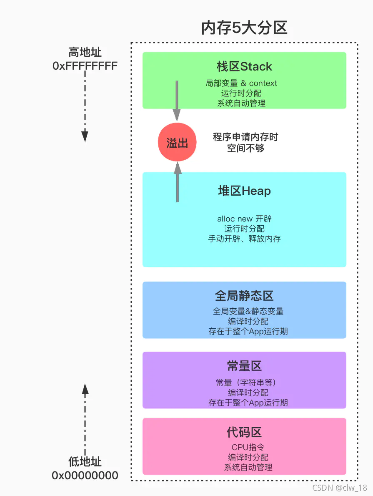

## **get 和 post 请求有哪些区别?**

GET和POST本质上就是TCP链接，并无差别。但是由于HTTP的规定和浏览器/服务器的限制，导致他们在应用过程中体现出一些不同。

- GET在浏览器回退时是无害的，而POST会再次提交请求。

- GET产生的URL地址可以被Bookmark，而POST不可以。

- GET请求会被浏览器主动cache，而POST不会，除非手动设置。

- GET请求只能进行url编码，而POST支持多种编码方式。

- GET请求参数会被完整保留在浏览器历史记录里，而POST中的参数不会被保留。

- GET请求在URL中传送的参数是有长度限制的，而POST么有。

- 对参数的数据类型，GET只接受ASCII字符，而POST没有限制。

- GET比POST更不安全，因为参数直接暴露在URL上，所以不能用来传递敏感信息。

- GET参数通过URL传递，POST放在Request body中。

  *GET和POST还有一个重大区别，简单的说：*

  *GET产生一个TCP数据包；POST产生两个TCP数据包。*

  *长的说：*

  *对于GET方式的请求，浏览器会把http header和data一并发送出去，服务器响应200（返回数据）；*

  *而对于POST，浏览器先发送header，服务器响应100 continue，浏览器再发送data，服务器响应200 ok（返回数据）。*

## 1.面向对象的三大特性：封装、继承、多态

**封装的含义是**：把客观事物抽象为类，包含自己的属性和方法。

**封装的好处**：1.良好的封装能够减少耦合

​					   2.类内部的结构可以自由修改

​					   3.可以对成员进行更精确的控制。

​					   4.隐藏信息，实现细节。

**继承的含义是：**使用现有类的所有功能，在无需重新编写原有类的情况下对类的功能进行拓展。被继承的类成为父类或基类，继承的类成为子类或派生类。

1、子类拥有父类非private的属性和方法。

2、子类可以拥有自己属性和方法，即子类可以对父类进行扩展。

3、子类可以用自己的方式实现父类的方法。

**多态的含义是：**一种形式，多种状态，分为静态多态和动态多态。静态多态指编译时多态，如函数重载、模板；动态多态指运行时多态，特指virtual虚函数机制形成的多态。

**多态的实现条件：**有继承关系，子类重写父类中的虚函数，父类指针或引用指向子类对象

## 2.类的访问权限：private、protected、public

## 3.类的构造函数、析构函数、赋值函数、拷贝函数

构造函数：一个类对象创建时自动调用的方法，用来完成初始化的工作

析构函数：当类对象生命周期结束时，自动销毁对象占有的内存

拷贝构造函数：参数为类的引用，即用一个类对象复制构造一个新的类对象

赋值函数：将一个类对象成员的值赋给当前对象。

一个类会自定义默认构造函数、默认拷贝构造函数，默认赋值函数、析构函数

## 4.移动构造函数与拷贝构造函数对比

拷贝构造函数的形参是一个左值引用，而移动构造函数的形参是一个右值引用 

拷贝构造函数完成的是整个对象或变量的拷贝，而移动构造函数是生成一个指针指向源对象或变量的地址，接管源对象的内存，相对于大量数据的拷贝节省时间和内存空间。

## 5.深拷贝与浅拷贝的区别

浅拷贝：利用类提供的默认拷贝构造函数，将一个对象的成员所在内存的数据复制给另一个对象的成员。

​	会造成重复释放内存，从而出现错误。

深拷贝：显式定义类的拷贝构造函数，不仅会将原对象的成员变量复制给新对象，还会在堆中为新对象分配一块新的内存，并将原对象持有的动态内存资源也拷贝过来。

## 6.空类有哪些函数？空类的大小？

一个空类包括默认构造函数、拷贝构造函数、析构函数、默认赋值运算符、默认取址运算符、this指针。 

空类也可以实例化，在内存会有独一无二的地址，编译器规定空类的大小为1字节； 仅含有一个虚函数的类的大小为4字节，因为虚表指针占有4个字节地址。

## 7.内存分区：全局区、堆区、栈区、常量区、代码区

C++程序在执行时，将内存大方向划分为**4个区域**

- 代码区：存放**函数体的二进制代码**，由操作系统进行管理的
- 全局区：存放**全局变量**和**静态变量**以及**常量**
- 栈区：由编译器自动分配释放, 存放**函数的参数值**,**局部变量**等
- 堆区：由程序员分配和释放,若程序员不释放,程序结束时由操作系统回收


全局区：存储全局变量和静态变量，编译时分配，存在整个程序运行期间。
堆区：程序员手动管理的内存区间，运行时分配，手动开辟、释放内存。
栈区：存储局部变量，运行时分配，系统自动管理内存的开辟和释放。
常量区：存放常量，编译时分配，存在整个程序运行期间。
代码区：存放程序运行的cpu指令，编译时分配，系统自动管理内存的开辟和释放。


## 8.堆区与栈区的对比

申请方式：栈区内存由系统自动管理，堆区内存由程序员手动管理。
空间大小：栈区的大小一般为1M或2M，不超过10M；堆区的大小是不固定的，受硬件内存的限制。
申请效率：栈是线性存储的，由系统自动分配，速度较快；堆区通过一个链表管理空闲内存，容易造成内存泄漏。
生长方向：栈区是由高到低的，堆区是由低到高的。

## 9.C++与C的区别

C++是面向对象的编程语言，C是面向过程的结构化编程语言。
C++采用new/delete运算符动态管理内存，而C用malloc/free库函数管理内存。
C++提供了class，C提供了struct。在C++中使用struct与class等同。
C++有引用，而C没有。
C++提供了很多输入输出流，如：iostream、ofstream。

## 10.extern C作用

指示编译器这部分代码按照C语言的方式进行编译。如：C语言不提供函数重载，为避免重载，可使用extern C。

## 11.C++为啥可以重载？C语言为啥不支持重载？

C语言中，函数在编译后的代码名称为“_函数名”，当同名的函数参数不同时，编译器无法解析到它们的不同，因为它们的编译名称都相同。

C++中，函数参数不同对象的编译后的名称也不同，所以支持重载。

## 12.struct与class的区别

struct在C中，不能定义函数、没有访问权限的设定，只能定义数据成员变量；在C++中，与class类似，可以定义函数、实现继承以及多态，以及有public、[protected](https://so.csdn.net/so/search?q=protected&spm=1001.2101.3001.7020)、private三种访问权限。

struct中成员默认的访问权限是public，class中成员默认的访问权限是private。

## 13.struct内存对齐

结构体中各成员变量的首地址必须是“对齐系数”和“变量大小”的较小值的整数倍； 

结构体占用内存的总大小是“对齐系数”和“最大变量长度”的较小值的整数倍。

1.**前面的地址必须是后面的地址正数倍,不是就补齐**

2.**整个Struct的地址必须是最大字节的整数倍**

## 14.define宏定义与const常量的区别

1.处理时机不同：宏定义是“编译时”概念，在预处理阶段展开，生命周期结束于编译时期；const是“运行时”概念，在程序运行时使用。
2.存储方式不同：宏定义直接替换，不会分配内存，存储在程序的代码区中；const变量需要进行内存分配。
3.类型和安全检查不同：宏定义是字符替换，没有数据类型的区别，没有类型安全检查；const是常量的声明，有类型区别，编译时会进行安全检查。

## 15.new/delete与malloc/free的区别

1、new/delete是C++的操作符，而malloc/free是C中的函数。

2、new做两件事，一是分配内存，二是调用类的构造函数；同样，delete会调用类的析构函数和释放内存。而malloc和free只是分配和释放内存。

3、new建立的是一个对象，而malloc分配的是一块内存；new建立的对象可以用成员函数访问，不要直接访问它的地址空间；malloc分配的是一块内存区域，用指针访问，可以在里面移动指针；new出来的指针是带有类型信息的，而malloc返回的是void指针。

4、new/delete是保留字，不需要头文件支持；malloc/free需要头文件库函数支持

5、malloc不能重载，new可以重载operator new

等等

## 16.new一个对象可以用free释放内存嘛？

首先：new和delete底层使用malloc和free实现的
其次：当是基本的数据类型时，delete和delete[]可以混用
用free也可以释放new出的空间，但是new[]的有时候就不可以
重点是最好还是不要混用

不会调用析构函数

内存new->operator new() -> malloc() --如果失败-->_callnewh(*func)回调函数-->返回非0继续malloc() 返回0抛出异常 当然复杂类型会先调用构造函数

delete -> operator delete() -> RTCCALLBACK(默认空的宏定义) -> free() 复杂类型也会先调用析构再调用operator delete()

**不可以。new一个对象，delete时会先调用类的析构函数再释放内存，而free仅仅释放内存，会出现错误。**

## 17.内存泄露的情况

new一块内存，没有手动delete，会造成内存泄漏； 

使用智能指针shared_ptr时，产生循环引用，导致内存无法释放，会造成内存泄漏； 

类的继承中，用一个基类指针指向父类或子类对象时，析构函数没有采用虚函数，生命期结束时导致子类对象占有内存无法释放，造成内存泄漏。

## 18.sizeof与strlen对比

sizeof计算的是分配的内存空间实际占用的字节数； strlen计算的是内存空间中字符的个数（不包括"\0"）。
sizeof是运算符，参数可以是指针、数组、类型、对象和函数； strlen是函数，参数必须是字符型指针（char*）。
sizeof是在编译时计算，故参数为数组名时计算的是整个数组的占用内存大小； strlen是在运行时计算，参数为数组名时，数组会退化为指针。

## 19.指针与引用的区别

引用本质是指针常量，指向的地址不变，地址里的内容可以改变。定义一个引用的时候，程序把该引用和它的初始值绑定在一起，而不是拷贝它。计算机必须**在声明r的同时就要对它初始化**，并且，**r一经声明，就不可以再和其它对象绑定在一起了。**

1、引用在创建时必须初始化，引用到一个有效对象；而指针在定义时不必初始化，可以在定义后的任何地方重新赋值。

2、指针可以是NULL，引用不行

3、引用貌似一个对象的小名，一旦初始化指向一个对象，就不能将其他对象重新赋值给该引用，这样引用和原对象的值都会被更改。

4、引用的创建和销毁不会调用类的拷贝构造函数和析构函数。

**指针**p也是**对象**，它同样有地址&p和存储的值p，对象有常量（const）和变量之分，既然指针本身是对象，那么指针所存储的地址也有常量和变量之分


**安全性：引用的对象不能改变，安全性好；但指针指向的对象是可以改变的，不能保证安全性。**
**方便性：引用实际上是封装好的指针解引用（即b->*b），可以直接使用；但指针需要手动解引用，使用更麻烦；**
**级数：引用只有一级，不能多次引用；但指针的级数没有限制。**
**初始化：引用必须被初始化为一个已有对象的引用，而指针可以初始化为NULL。**

## 20.指针函数与函数指针

指针函数：返回值是指针的函数，本质上是一个函数；

int *fun(int x,int y); 

函数指针：指向一个函数的指针，本质上是一个指针

int (*fun)(int x,int y);

## 21.野指针产生与避免

野指针是指向位置随机的、不正确的指针，系统无法对其进行操作；

#### 野指针的危害

野指针指向的位置是随机的， 危害也是随机的，不一定会产生错误。若程序产生错误，一般为内存泄露导致程序中断。严重的情况，若野指针指向的位置存放一个病毒，对其解引用后就会导致电脑中毒。

##### 野指针产生的原因

1、创建指针时没有对指针进行初始化，导致指针指向一个随机的位置；
2、释放指针指向的内存后没有置空，从而指向垃圾内存；
3、在超越变量[作用域](https://so.csdn.net/so/search?q=作用域&spm=1001.2101.3001.7020)下使用指针，如：在栈内存被释放之后，指向栈内存的指针会指向垃圾内存；

##### 野指针的避免方法：

1、在创建指针时必须进行初始化；
2、在释放指针指向的内存之后必须将指针置空；

## 22.多态：动态多态、静态多态

动态多态：运行时多态，通过指向基类的引用或指针来操作子类对象，对虚函数的调用会自动绑定到实际提供的子类对象。
当派生类继承基类时，在基类中利用virtual关键字定义若干个虚函数，会生成基类的虚表A，表中存放着所有虚函数的地址，而在派生类中重写某个虚函数func1时，派生类的的虚表B中，会用重写的虚函数地址覆盖原来的函数func1的地址，其它虚函数地址不变。程序采用迟绑定的编译模式，当基类指针指向基类对象时，基类对象的vptr指向虚表A，就会运行基类的func1；而基类指针指向派生类对象时，派生类对象的vptr指向虚表B，就会运行派生类的func1。这样，**根据基类指针指向不同的对象，进而调用不同的函数体，就会有不同的表现形式，即实现动态多态**。（虚函数实现多态的原理）

静态多态：编译时多态，模板、函数重载均为静态多态。


## 23.虚函数实现动态多态的原理、虚函数与纯虚函数的区别

纯虚函数是在基类中只声明不定义的虚函数，提供多态实现的接口，其声明方式为“virtual void function()=0”。 

含有纯虚函数的基类是纯虚基类，不能生成对象。 

派生类中必须对基类中声明的纯虚函数进行定义，否则无法编译。

## 24.继承时，父类的析构函数是否为虚函数？构造函数能不能为虚函数？为什么？

**析构函数应为虚函数：**

若不用虚函数，对象生命期结束时，只会释放父类占有的内存，而不会释放子类内存，造成内存泄漏。

**构造函数不能为虚函数：**

虚函数的作用是通过基类指针来调用子类的成员函数，而构造函数是在创建对象时自己主动调用的，不需要通过基类指针去调用；

若构造函数是虚函数，会有相应的虚表指针vptr指向虚函数表，但是对象只有通过构造函数实例化，才能生成虚表指针，这是矛盾的。

## 25.静态多态：重写、重载、模板

 函数重载：函数参数类型不同、个数不同、顺序不同，导致编译时识别的函数名称不同。

 模板：分为函数模板和类模板，通常由template声明。

## 26.static关键字：修饰局部变量、全局变量、类中成员变量、类中成员函数

static+局部变量：存储在静态区，存在于整个程序运行期间。函数外部无法访问该变量。
static+全局变量：存储在静态区，存在于整个程序运行期间。只存在于当前文件，其他cpp文件无法访问。
static+类中成员变量：属于类而不属于某个对象，不具有this指针。类内定义，类外初始化。
static+类中成员函数：属于类而不属于某个对象，不具有this指针。无法访问类的非静态成员函数和非静态成员变量。

## 27.const关键字：修饰变量、指针、类对象、类中成员函数

const+变量：常量。 

const+指针：常指针。 

const+类对象：对象的任何成员都不能被修改，只能调用const成员函数。 

const+成员变量：变量的值不能修改，只能在初始化时赋值。 

const+成员函数：不能调用非const成员函数和非const成员变量。

## 28.extern关键字：修饰全局变量

声明函数或全局变量的作用范围的关键字，其声明的函数和变量可以在本模块活其他模块中使用，记住它是一个声明不是定义!

**extern+全局变量：表示该全局变量在其他文件中已经定义，可以直接使用。**

#### 关于extern和static：

extern的作用为让变量或者函数跨文件，而static的作用是让变量或者函数的作用域保留在本文件中，所以二者不能同时使用。

#### extern 和const：

当const单独使用时它就与static相同，而当与extern一起合作的时候，它的特性就跟extern的一样了！

## 29.volatile关键字：避免编译器指令优化

## 30.四种类型转换：static_cast、dynamic_cast、const_cast、reinterpret_cast

static_cast：用于编译器无法自动执行的类型转换；
dynamic_cast：将一个基类指针（或引用）转换为派生类指针（或引用），一般用于有继承关系的类中；
const_cast：将const修饰的常量转换为非常量，一般用于重载函数中；
reinterpret_cast：将变量从类型1转换为类型2，编译器会当作类型2，真实类型为类型1。（不建议使用）

## 31.右值引用

右值，就是在内存没有确定存储地址、没有变量名，表达式结束就会销毁的值。顾名思义，右值引用就是对右值的引用。

引入右值引用的原因：

```
替代需要销毁对象的拷贝，提高效率；
使用move移动含有不能共享资源的类对象
```

## 32.std::move函数

move告诉编译器将左值像对待同类型右值一样处理，但是被调用后的左值将不能再被使用。常用于内存资源所有权的转移，避免内存重复拷贝及释放。

std::move 基本等同于一个类型转换：static_cast<T&&>(lvalue)

## 33.std::forward与std::move的区别

std::move，将左值转换为右值，从而将转移内存资源的所有权，不用进行内存拷贝。
std::forward，完美转发，参数将左值时返回左值引用，参数为右值时返回右值引用。
万能引用：当一个参数或变量被声明为T&&，其中T是被推导的类型，那么这个参数或变量就是万能引用。即传入的可以是左值也可以是右值。

## 34.四种智能指针及底层实现：auto_ptr、unique_ptr、shared_ptr、weak_ptr

auto_ptr：提供了拷贝构造、拷贝赋值操作，再置空原对象指针成员，这样显得拷贝毫无意义，而且在使用中极易误操作原对象，从而出现错误且很难发现
unique_ptr：利用移动构造函数和移动赋值函数来实现资源的转移，即通过右值引用方式来销毁原对象，并把内存资源的所有权转移给新对象。

所有shared_ptr对象中通过同一个计数器来计算资源的引用计数_Uses，可通过拷贝构造函数、移动构造函数、赋值函数来增加新的shared_ptr指向该对象，并自动调用计数器递增引用计数。当某个shared_ptr生命期结束时，会自动调用析构函数，析构函数中会递减它所指向对象的引用计数，若强引用计数为0，析构函数就会调用计数器的_Destroy() 函数释放内存资源。

shared_ptr可以有多个指针对内存进行管理，unique_ptr只能有一个进行管理，如果想让别人进行管理，就必须放弃原来的管理权进行转移(move)。

shared_ptr 如果管理的是数组类型的内存，需要指定删除器，自己构造或者default_delete<>()

unique_ptr删除器如果是lambda表达式，捕捉方式如果有，需要用包装器。

独占的智能指针可以管理数组类型的地址，能够自动释放 unique_ptr<Test []> ptr(new Test[3]); c++11后shared_ptr也支持

## 35.shared_ptr中的循环引用怎么解决？（weak_ptr）

在可能出现循环引用的地方使用weak_ptr来替代shared_ptr。

## 36.vector、list、deque比较

vector：

```
相当于一个动态数组，可实现容器长度的变化，在内存上占有一段连续的地址空间；
擅长随机访问以及在容器尾部添加或删除元素，效率较高；
在容器头部及中间位置插入或删除元素，需要移动该位置以后的所有元素，效率较低；
```

list：

```
容器中各个元素的前后顺序靠指针联系在一起，在内存中不一定是连续的地址空间；
擅长随机插入或删除元素，只改变前后两个元素的联系，效率高；
不擅于随机访问元素，遍历容器需要访问大量指针，效率极低；
```

deque:

```
将多个连续内存空间通过指针数组连接在一起，不能保证所有元素在同一段连续的地址空间中；
容器的地址空间是动态变化的，可以向两端进行伸缩，内部实现比较复杂；
擅长在容器首部、尾部插入或删除元素，效率高；
```


## 37.vector迭代器失效的情况

push_back导致迭代器失效：当容量不足时会触发扩容，导致整个vector重新申请内存，造成迭代器失效。

insert导致迭代器失效：与push_back类似。

erase导致迭代器失效：导致被删除位置之后的元素移动，导致被移动部分的迭代器失效。

## 38.map与unordered_map对比

有序性：map是有序的，unordered_map是无序的。
底层数据结构：map底层数据结构是红黑树，unordered_map底层数据结构是哈希表。
查询、插入效率：map查询时间复杂度为O(logn)，unordered_map查询时间复杂度为O(1)。
占用内存：unordered_map占用内存比map小。

## 39.unordered_map与unordered_set对比

unordered_map是key-value式存储的，unordered_set是key式存储的。

## 40.set与unordered_set对比

set

- 定义于<set>头文件
- 底层实现通常是平衡二叉树
- 元素自动排序，这为查找元素提供了良好性能，但同时也造成了一个重要限制：不能直接改变元素值，因为这会打乱原本正确的顺序
- 查找函数具有对数复杂度
- 要改变元素的值，必须先删除该元素，再插入新元素

unordered_set

- 定义于<unordered_set>头文件
- 底层实现通常是hash-table
- 元素是无序的

## 41.枚举类型

针对C++98中枚举类型的一些缺点，C++11做了如下扩展：

- 在C++98中，枚举值没有类或者命名空间的约束，两个枚举类型的枚举值若是一样，则会产生冲突， 在C++11中，采用类名来约束，从而避免了冲突。
- 在C++98中，枚举值和整型可以隐式转换，在C++11中，必须显示转换。
- 在C++98中，底层存储大小不确定，在C++11中，可以指定底层存储类型。

## 42.内存对齐

 **1.必须是2的幂**

 **2.必须是(void *)的整数倍**

**在32位和64位的对齐单位分别为8字节和16字节**

## 43.this指针

现在编译器在处理成员函数和对成员函数调用时，即非静态成员函数实际上的形参个数比程序员写的多一个。多出来的参数就是所谓的“this指针”。这个“this指针”指向了成员函数作用的对象，在成员函数执行的过程中，正是通过“this指针”才能找到对象所在的地址，因而也就能找到对象的所有非静态成员变量的地址。

## 44.接口和抽象类

接口描述了类的行为和功能，而不需要完成类的特定实现。 

c++接口是使用抽象类来实现的。

如果类中至少有一个函数声明为纯虚函数，则这个类就是抽象类。
