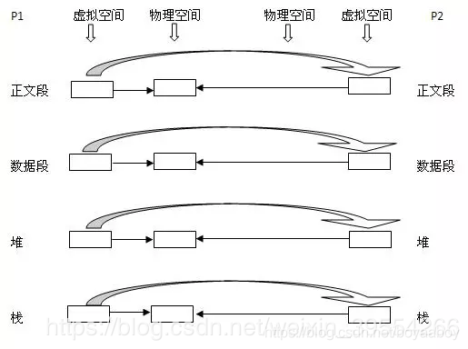
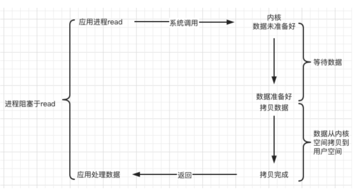
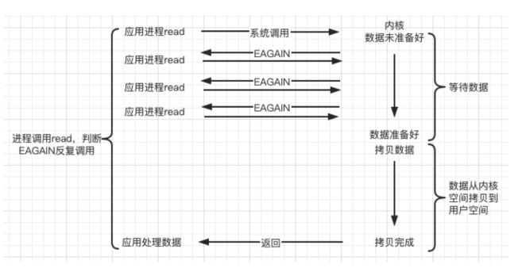
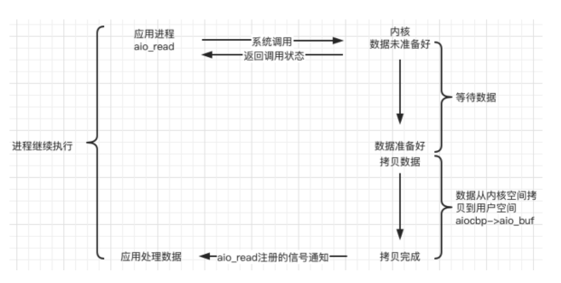
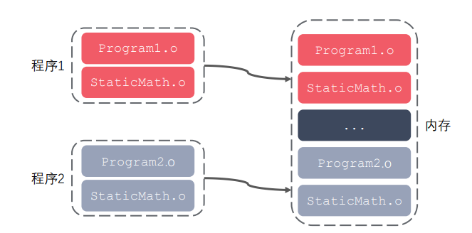
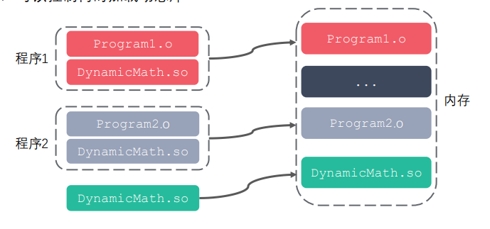

## 1、进程与线程区别

1、根本区别： 进程是操作系统资源分配和独立运行的最小单位；线程是任务调度和系统执行的最小单位。
2、地址空间区别： 每个进程都有独立的地址空间，一个进程崩溃不影响其它进程；一个进程中的多个线程共享该 进程的地址空间，一个线程的非法操作会使整个进程崩溃。
3、上下文切换开销区别： 每个进程有独立的代码和数据空间，进程之间上下文切换开销较大；线程组共享代码和数据空间，线程之间切换的开销较小。
————————————————

   （1）线程是由进程创建而来，是cpu调度的最小单位。

   （2）每个进程都有自己独立的地址空间，而进程中的多个线程共用进程的资源，他们只有自己独立的栈资源。

进程=火车，线程=车厢

- 线程在进程下行进（单纯的车厢无法运行）
- 一个进程可以包含多个线程（一辆火车可以有多个车厢）
- 不同进程间数据很难共享（一辆火车上的乘客很难换到另外一辆火车，比如站点换乘）
- 同一进程下不同线程间数据很易共享（A车厢换到B车厢很容易）
- 进程要比线程消耗更多的计算机资源（采用多列火车相比多个车厢更耗资源）
- 进程间不会相互影响，一个线程挂掉将导致整个进程挂掉（一列火车不会影响到另外一列火车，但是如果一列火车上中间的一节车厢着火了，将影响到所有车厢）
- 进程可以拓展到多机，进程最多适合多核（不同火车可以开在多个轨道上，同一火车的车厢不能在行进的不同的轨道上）
- 进程使用的内存地址可以上锁，即一个线程使用某些共享内存时，其他线程必须等它结束，才能使用这一块内存。（比如火车上的洗手间）－"互斥锁"
- 进程使用的内存地址可以限定使用量（比如火车上的餐厅，最多只允许多少人进入，如果满了需要在门口等，等有人出来了才能进去）－“信号量”


进程和线程的选择

综上，线程创建和销毁的代价低、上下文切换速度快、对系统资源占用小、对CPU的使用效率高，因此一般情况下优先选择线程进行高并发编程；但线程组的所有线程共用一个进程的内存空间，安全稳定性相对较差，若其中一个线程发生崩溃，可能会使整个进程，因此对安全稳定性要求较高时，需要优先选择进程进行高并发编程。
————————————————

协程与线程的区别
1、根本区别： 协程是用户态的轻量级线程，不受内核调度；线程是任务调度和系统执行的最小单位，需要内核调度。
2、运行机制区别： 线程和进程是同步机制，而协程是异步机制。
3、上下文切换开销区别： 线程运行状态切换及上下文切换需要内核调度，会消耗系统资源；而协程完全由程序控制，状态切换及上下文切换不需要内核参与。
————————————————

## 2、线程同步的方式：互斥锁、自旋锁、读写锁、条件变量

所谓**线程同步**，就是有多个线程共享相同的内存时，需要确保共享数据在每个线程中都是一致的。若同一个共享变量在两个及以上线程中所显示的结果是不一样的，就表明线程不同步。

一、互斥锁
互斥锁保证资源访问的串行
它针对特定线程给临界资源加锁，加锁时其它线程无法访问该临界资源，只能进入睡眠状态
原子性：一系列操作不可被中断的特性

二、自旋锁
效果同互斥量，但申请调用自旋锁资源的线程会反复检查锁变量是否可用，直到资源被释放为止
自旋锁避免了进程/线程的上下文开销，但不适合单核CPU

三、读写锁
读写锁是一种特殊的自旋锁，允许同时读取，但不允许同时写入
它适合多读少写的场景

四、条件变量
条件变量允许线程睡眠，直到满足特定条件时唤醒

## 3、互斥锁与自旋锁的底层区别

如果你能确定被锁住的代码执行时间很短，就不应该用互斥锁，而应该选用自旋锁，否则使用互斥锁。 

自旋锁是通过 CPU 提供的 CAS 函数（Compare And Swap），在「用户态」完成加锁和解锁操作，不会主动产生线程上下文切换，所以相比互斥锁来说，会快一些，开销也小一些。

**当加锁失败时，互斥锁用「线程切换」来应对，自旋锁则用「忙等待」来应对。** 

## 4、孤儿进程与僵尸进程

父进程运行结束，但子进程还在运行（未运行结束），这样的子进程就称为孤儿进程 （Orphan Process）。 

每当出现一个孤儿进程的时候，内核就把孤儿进程的父进程设置为 init ，而 init  进程会循环地 wait() 它的已经退出的子进程。这样，当一个孤儿进程凄凉地结束 了其生命周期的时候，init 进程就会代表党和政府出面处理它的一切善后工作。 

因此孤儿进程并不会有什么危害


每个进程结束之后, 都会释放自己地址空间中的用户区数据，内核区的 PCB 没有办法 自己释放掉，需要父进程去释放。 

进程终止时，父进程尚未回收，子进程残留资源（PCB）存放于内核中，变成僵尸 （Zombie）进程。 

僵尸进程不能被 kill -9 杀死，这样就会导致一个问题，如果父进程不调用 wait()  或 waitpid() 的话，那么保留的那段信息就不会释放，其进程号就会一直被占用， 但是系统所能使用的进程号是有限的，如果大量的产生僵尸进程，将因为没有可用的进 程号而导致系统不能产生新的进程，此即为僵尸进程的危害，应当避免。


## 5、死锁及避免

有时，一个线程需要同时访问两个或更多不同的共享资源，而每个资源又都由不同的互 斥量管理。当超过一个线程加锁同一组互斥量时，就有可能发生死锁。

两个或两个以上的进程在执行过程中，因争夺共享资源而造成的一种互相等待的现象， 若无外力作用，它们都将无法推进下去。此时称系统处于死锁状态或系统产生了死锁。

死锁的几种场景：

忘记释放锁 

重复加锁 

多线程多锁，抢占锁资源

**当然死锁的产生是必须要满足一些特定条件的：** 
1.互斥条件：进程对于所分配到的资源具有排它性，即一个资源只能被一个进程占用，直到被该进程释放 
2.请求和保持条件：一个进程因请求被占用资源而发生阻塞时，对已获得的资源保持不放。 
3.不剥夺条件：任何一个资源在没被该进程释放之前，任何其他进程都无法对他剥夺占用 
4.循环等待条件：当发生死锁时，所等待的进程必定会形成一个环路（类似于死循环），造成永久阻塞。


避免死锁：

在有些情况下死锁是可以避免的。

**1、控制线程加锁的顺序，保证不会出现环路等待条件**

**2、使用定时锁，超时释放占有的锁**

1. [加锁顺序](http://ifeve.com/deadlock-prevention/#ordering)
2. [加锁时限](http://ifeve.com/deadlock-prevention/#timeout)
3. [死锁检测](http://ifeve.com/deadlock-prevention/#detection)

## 6、多线程与多进程比较

```
耗CPU的操作，用多进程编程，对于IO操作来说，使用多线程编程，进程切换代价高于线程。
1 对于耗CPU的操作，多进程优于多线程
2 对于IO操作来说，多线程优于多进程
```

1、多线程可以共享全局变量，多进程不能

2、多线程中，所有子线程的进程号相同;多进程中，不同的子进程进程号不同

3、线程共享内存空间;进程的内存是独立的

4、同一个进程的线程之间可以直接交流;两个进程想通信，必须通过一个中间代理来实现

5、创建新线程很简单;创建新进程需要对其父进程进行一次克隆

6、一个线程可以控制和操作同一进程里的其他线程;但是进程只能操作子进程

两者最大的不同在于：在多进程中，同一个变量，各自有一份拷贝存在于每个进程中，互不影响;而多线程中，所有变量都由所有线程共享 。


## 7、进程间通信：PIPE、FIFO、消息队列、信号量、共享内存、socket

1.管道（Pipe）及有名管道（named pipe）：管道可用于具有亲缘关系进程间的通信，有名管道克服了管道没有名字的限制，因此，除具有管道所具有的功能外，它还允许无亲缘关系进程间的通信；管道用于两个相关进程之间的通信，这是一种半双工的通信方式，如果需要全双工，需要另外一个管道。

2.信号（Signal）：信号是比较复杂的通信方式，用于通知接受进程有某种事件发生，除了用于进程间通信外，进程还可以发送信号给进程本身；linux除了支持Unix早期信号语义函数sigal外，还支持语义符合Posix.1标准的信号函数sigaction（实际上，该函数是基于BSD的，BSD为了实现可靠信号机制，又能够统一对外接口，用sigaction函数重新实现了signal函数）；

3.报文（Message）队列（消息队列）：消息队列是内核中存储消息的链表，它由消息队列标识符进行标识，这种方式能够在不同的进程之间提供全双工的通信连接。消息队列克服了信号承载信息量少，管道只能承载无格式字节流以及缓冲区大小受限等缺点。

4.共享内存：使得多个进程可以访问同一块内存空间，是最快的可用IPC形式。是针对其他通信机制运行效率较低而设计的。往往与其它通信机制，如信号量结合使用，来达到进程间的同步及互斥。

5.信号量（semaphore）：主要作为进程间以及同一进程不同线程之间的同步手段。

6.套接口（Socket）：更为一般的进程间通信机制，可用于不同机器之间的进程间通信。起初是由Unix系统的BSD分支开发出来的，但现在一般可以移植到其它类Unix系统上：Linux和System V的变种都支持套接字。

## 8、管道与消息队列对比

PIPE是一种非永久性的管道通信机构，当它访问的进程全部终止时，它也将随之被撤消；它也不能用于不同族系的进程之间的通信。而FIFO是一种永久的管道通信机构，它可以弥补PIPE的不足。管道文件被创建后，使用open()将文件进行打开，然后便可对它进行读写操作，通过系统调用write()和read()来实现。通信完毕后，可使用close()将管道文件关闭。因为匿名管道的文件是内存中的特殊文件，而且是不可见的，命名管道的文件是硬盘上的设备文件，是可见的。

消息队列与命名管道类似，但少了打开和关闭管道方面的复杂性。使用消息队列并未解决我们在使用命名管道时遇到的一些问题，如管道满时的阻塞问题。

与命名管道相比：消息队列的优势在于，它独立于发送和接收进程而存在，这消除了在同步命名管道的打开和关闭时可能产生的一些困难。

**消息队列与管道相比，其优势是对每个消息指定特定的消息类型，接收的时候不需要按照队列次序进行接收，而是可以根据自定义条件接收特定的消息。**

可以把消息看做一个记录，具有特定的格式以及特定的优先级。对消息队列有写权限的进程可以向消息队列按照一定的规则添加一条消息，对消息队列有读权限的进程可以从消息队列中读取消息。

## 9、fork进程的底层：读时共享，写时复制

如果有多个调用者（callers）同时请求相同资源（如内存或磁盘上的数据存储），他们会共同获取相同的指针指向相同的资源，直到某个调用者试图修改资源的内容时，系统才会真正复制一份专用副本（private copy）给该调用者，而其他调用者所见到的最初的资源仍然保持不变。

1、父子进程之间在刚fork后，刚刚创建子进程后：（下面的要理解背会，面试）
（1）**父子相同处**: 全局变量、.data、.bbs、.text、栈、堆、环境变量、用户ID、宿主目录（进程用户家目录）、进程工作目录、信号处理方式等等，即0~3G的用户空间是完全一样的。
（2）**父子不同处**: 1.进程ID 2.fork返回值 3.父进程ID 4.进程运行时间 5.闹钟(定时器) 6.未决信号集

读时共享写时复制这一机制是由MMU（内存管理单元）来实现的。



## 10、线程上下文切换的流程

**利用了时间片轮转的方式, CPU 给每个任务都服务一定的时间，然后把当前任务的状态保存下来，在加载下一任务的状态后，继续服务下一任务，任务的状态保存及再加载, 这段过程就叫做上下文切换。**

 时间片（timeslice）又称为“量子（quantum）”或“处理器片（processor slice）” 是操作系统分配给每个正在运行的进程微观上的一段 CPU 时间。

上下文切换的活动：

（1）. 挂起一个进程，将这个进程在 CPU 中的状态（上下文）存储于内存中的某处。

（2）. 在内存中检索下一个进程的上下文并将其在 CPU 的寄存器中恢复。

（3）. 跳转到程序计数器所指向的位置（即跳转到进程被中断时的代码行），以恢复该进程在程序中。

进程切换与线程切换的一个最主要区别就在于进程切换涉及到虚拟地址空间的切换而线程切换则不会。

## 11、进程上下文切换的流程

#### 进程切换的步骤

1.切换新的页表，然后使用新的虚拟地址空间
2.切换内核栈，加入新的内容(PCB控制块，资源相关)，硬件上下文切换


#### 进程上下文切换由以下4个步骤组成:

1.**决定是否作上下文切换以及是否允许作上下文切换。包括对进程调度原因的检查分析，以及当前执行进程的资格和CPU执行方式的检查等**。在操作系统中，上下文切换程序并不是每时每刻都在检查和分析是否可作上下文切换，它们设置有适当的时机。
2.**保存当前执行进程的上下文**。这里所说的当前执行进程，实际上是指调用上下文切换程序之前的执行进程。如果上下文切换不是被那个当前执行进程所调用，且不属于该进程，则所保存的上下文应是先前执行进程的上下文，或称为“老”进程上下文。显然，上下文切换程序不能破坏“老”进程的上下文结构。
3**.使用进程调度算法，选择一处于就绪状态的进程。**
4.**恢复或装配所选进程的上下文，将CPU控制权交到所选进程手中。**


进程切换与线程切换的一个最主要区别就在于进程切换涉及到虚拟地址空间的切换而线程切换则不会。

#### **为什么虚拟地址空间切换会比较耗时呢？**

进程都有自己的虚拟地址空间，把虚拟地址转换为物理地址需要查找页表，页表查找是一个很慢的过程，因此通常使用Cache来缓存常用的地址映射，这样可以加速页表查找，这个cache就是TLB。由于每个进程都有自己的虚拟地址空间，那么显然每个进程都有自己的页表，那么**当进程切换后页表也要进行切换，页表切换后TLB就失效了**，cache失效导致命中率降低，那么虚拟地址转换为物理地址就会变慢，表现出来的就是程序运行会变慢，而线程切换则不会导致TLB失效，因为线程无需切换地址空间，因此我们通常说线程切换要比较进程切换块，原因就在这里。

## 12、进程的调度算法

- [01. 进程调度算法概述](https://www.cnblogs.com/szitcast/p/10927375.html#01-进程调度算法概述)

  调度算法是指：根据系统的资源分配策略所规定的资源分配算法

- [02. 先来先服务调度算法](https://www.cnblogs.com/szitcast/p/10927375.html#02-先来先服务调度算法)

  当每个进程就绪后，它加入就绪队列。当前正运行的进程停止执行，选择在就绪队列中存在时间最长的进程运行。该算法既可以用于作业调度，也可以用于进程调度。先来先去服务比较适合于常作业（进程），而不利于段作业（进程）。

- [03. 时间片轮转调度法](https://www.cnblogs.com/szitcast/p/10927375.html#03-时间片轮转调度法)

  在这种算法中，系统将所有就绪进程按到达时间的先后次序排成一个队列，进程调度程序总是选择就绪队列中第一个进程执行，即先来先服务的原则，但仅能运行一个时间片，如100ms。在使用完一个时间片后，即使进程并未完成其运行，它也必须释放出（被剥夺）处理机给下一个就绪的进程，而被剥夺的进程返回到就绪队列的末尾重新排队，等候再次运行。

- [04. 短作业(SJF)优先调度算法](https://www.cnblogs.com/szitcast/p/10927375.html#04-短作业sjf优先调度算法)

  短作业优先(SJF)调度算法是从后备队列中选择一个或若干个估计运行时间最短的作业，将它们调入内存运行。而短进程优先(SPF)调度算法，则是从就绪队列中选择一个估计运行时间最短的进程，将处理机分配给它，使之立即执行，直到完成或发生某事件而阻塞时，才释放处理机。

- [05. 最短剩余时间优先](https://www.cnblogs.com/szitcast/p/10927375.html#05-最短剩余时间优先)

- [06. 高响应比优先调度算法](https://www.cnblogs.com/szitcast/p/10927375.html#06-高响应比优先调度算法)

- [07. 优先级调度算法](https://www.cnblogs.com/szitcast/p/10927375.html#07-优先级调度算法)

- [08. 多级反馈队列调度算法](https://www.cnblogs.com/szitcast/p/10927375.html#08-多级反馈队列调度算法)


**实时进程的调度方式：** 静态优先级策略+先进先出策略/轮转策略

**普通进程的调度方式：** 动态优先级策略

系统调度时，会关注进程近一段时间内的表现（主要是睡眠时间和执行时间），再根据公式计算动态优先级，并严格按照动态优先级的高低顺序执行进程。

## 13、阻塞IO与非阻塞IO

阻塞IO

当用户线程发出IO请求之后，内核会去查看数据是否就绪，如果没有就绪就会等待数据就绪，而用户线程就会处于阻塞状态，用户线程交出CPU。当数据就绪之后，内核会将数据拷贝到用户线程，并返回结果给用户线程，用户线程才解除block状态。



非阻塞IO

 当用户线程发起一个read操作后，并不需要等待，而是马上就得到了一个结果。如果结果是一个error时，它就知道数据还没有准备好，于是它可以再次发送read操作。一旦内核中的数据准备好了，并且又再次收到了用户线程的请求，那么它马上就将数据拷贝到了用户线程，然后返回。



## 14、同步与异步的概念

**同步：**

所谓同步，就是在发出一个功能调用时，在没有得到结果之前，该调用就不返回。也就是必须一件一件事做,等前一件做完了才能做下一件事。

《网络编程》linux上的五种IO模型

阻塞，非阻塞，IO复用，信号驱动都是同步IO

**异步：**

异步的概念和同步相对。当一个异步过程调用发出后，调用者不能立刻得到结果。实际处理这个调用的部件在完成后，通过状态、通知和回调来通知调用者。



## 15、静态链接与动态链接的过程

静态库：把库文件看成一种代码仓库，它提供给使用 者一些可以直接拿来用的变量、函数或类

静态链接的过程：根据源文件中包含的头文件和程序中使用到的库函数，将目标文件和我们的如hello.o这个文件进行链接形成我们的可执行文件

**静态链接的优缺点**

缺点：浪费空间    		 因为每个可执行程序中对所有需要的目标文件都要有一份副本  

​			更新比较困难	因为每当库函数的代码修改了，这个时候就需要重新进行编译链接形成可执行程序

优点:   在可执行程序中已经具备了所有执行程序所需要的任何东西，在执行的时候运行速度快



**静态链接和动态链接两者最大的区别就在于链接的时机不一样，静态链接是在形成可执行程序前，而动态链接的进行则是在程序执行时。**

动态链接：动态链接的基本思想是把程序按照模块拆分成各个相对独立部分，在程序运行时才将它们链接在一起形成一个完整的程序。

动态链接的过程：假设现在有两个程序program1.o和program2.o，这两者共用同一个库lib.o,假设首先运行程序program1，系统首先加载program1.o，当系统发现program1.o中用到了lib.o，即program1.o依赖于lib.o，那么系统接着加载lib.o，如果program1.o和lib.o还依赖于其他目标文件，则依次全部加载到内存中。当program2运行时，同样的加载program2.o，然后发现program2.o依赖于lib.o，但是此时lib.o已经存在于内存中，这个时候就不再进行重新加载，而是将内存中已经存在的lib.o映射到program2的虚拟地址空间中，从而进行链接（这个链接过程和静态链接类似）形成可执行程序。

**动态链接的优缺点**

缺点：加载速度比静态库慢

​			发布程序时需要提供依赖的动态库

优点：可以实现进程间资源共享（共享库）

​			更新、部署、发布简单

​			可以控制何时加载动态库



## 16、虚拟内存概念（非常重要）

`虚拟内存`是一种内存分配方案，是一项可以用来辅助内存分配的机制。我们知道，应用程序是按页装载进内存中的。但并不是所有的页都会装载到内存中，计算机中的硬件和软件会将数据从 RAM 临时传输到磁盘中来弥补内存的不足。如果没有虚拟内存的话，一旦你将计算机内存填满后，计算机会对你说**您无法再加载任何应用程序，请关闭另一个应用程序以加载新的应用程序**。对于虚拟内存，计算机可以执行操作是查看内存中最近未使用过的区域，然后将其复制到硬盘上。

**虚拟内存是操作系统为每个进程提供的一种抽象，每个进程都有属于自己的、私有的、地址连续的虚拟内存.页表中记录了虚拟内存地址到物理内存地址的映射关系。有了页表就可以将虚拟地址转换为物理内存地址了，这种机制就是虚拟内存**。


**虚拟内存可以让程序拥有超过系统实际物理内存大小的可用内存空间**

虚拟内存会为每个进程提供一个一致的，私有的地址空间，它让每个进程都拥有一片连续完整的内存空间，这样能更加有效管理内存并减少出错

虚拟内存是计算机系统内存管理的一种技术，可以手动设置电脑的虚拟内存

**虚拟内存的一个重要意义**：定义了一个连续的虚拟地址空间，并将内存扩展到了硬盘空间

## 17、MMU地址翻译的具体流程

MMU是 MemoryManagementUnit 的缩写即，内存管理单元

MMU 的作用：

1. 将**虚拟地址映射到物理地址**，然后访问实际的物理地址
2. 访问权限控制


流程简要描述：

CPU执行一条指令，产生虚拟地址，将该虚拟地址传入MMU，MMU根据VPO**虚拟页面偏移**,VPN**虚拟页号**,TLBI**虚拟页号**,TLBT**TLB 标记位**查询TLB找到页表条目，并返回值PPN。

PPN和PPO构造物理地址，遍历高速缓存（内存），命中返回。

## 18、缺页处理过程

CPU执行一条指令，产生虚拟地址，将该虚拟地址传入MMU，MMU检查TLB是否有页表条目的缓存，即是否缺页，缺页了，判断内存是否有空闲页框，有的话，将空闲页框分配给该进程，进行IO操作从磁盘中调度缺的页到空闲页框，然后修改页表。如果没有空闲页框，通过缺页置换算法获取空闲页框，然后进行上面操作。

## 19、缺页置换算法：最近最久未使用算法、先进先出算法、最佳置换算法

**最佳置换算法：**

被淘汰页面是以后永不使用或最长时间内不再访问的页面（往后看）缺页率50%

**先进先出置换算法**：

优先淘汰最早进入内存的页面。（往前看）

**最近最久未使用（LRU）算法**：

淘汰最近最长时间未访问过的页面。（往前看）

## 20、c++读取utf8f等不同编码文件

读取文本文件之前先判断BOM，（一般情况下文件开头有个BOM（Byte Order Mark）作为标识，一般文本编码的BOM：ANSI没有BOM，UNICODE小端：FF FE ，大端：FE FF，UTF-8：EF BB BF），

打开这几种字符方法基本相同，ANSI和UNICODE 都可以用fopen，如果有中文在进行格式的转换即可，UFT-8需要用_wfopen(L"utf8.txt", L"r,ccs=utf-8")打开。

## 21、从键盘输入到屏幕输出的整个过程

1.每当有击键发生时，键盘中的设备8048会把键盘扫描码发给主板上的设备8042.

2.8042是按字节来处理的，每处理一个字节的扫描码后，将其存储到自己的输出缓冲区寄存器。

3.然后向终端代理8059A发送中断信号，这样我们的键盘中断处理程序通过读取8042的输出缓冲区寄存器，会获得键盘扫描码。

4.将键盘码转换成ASCII码，并输出到一个缓冲区里，然后输出到屏幕上。

## 22、系统调用过程

系统调用是操作系统提供给用户的一组接口，每个系统调用都有一个对应的系统调用函数来完成相应的工作。用户在用户空间执行某些函数（如C库里的fork，open等），在函数中会执行一个软中断指令，产生一个软中断，使CPU陷入内核态，接着在内核中进行一系列的判断，判断出哪个系统调用，再转到真正的系统调用函数，完成响应的功能。

## 23、Linux系统启动过程

主要5个阶段：

**内核的引导**

**运行init**

​	守护进程，运行级别7个

**系统初始化**

​	rc.sysinit是每一个运行级别都要首先运行的重要脚本，它主要完成的工作有：激活交换分区，检查磁盘，加载	硬件模块以及其它一些需要优先执行任务。

**建立终端**

**用户登陆系统**
