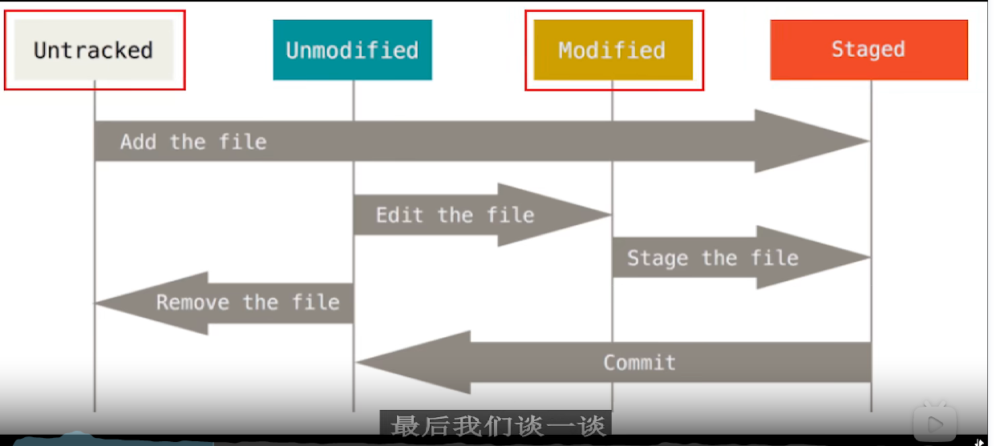
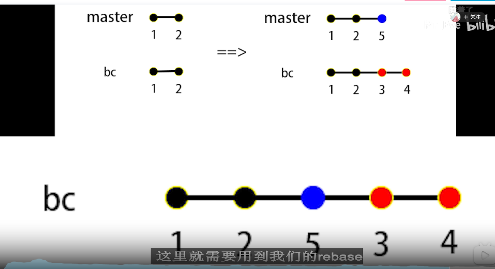
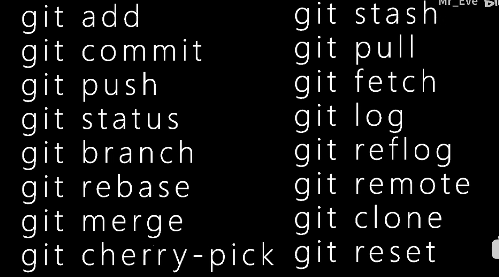
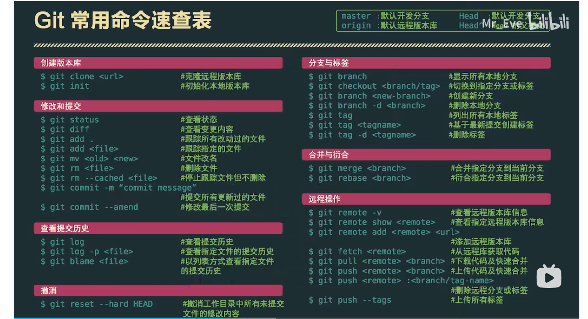

## 抓包工具 Charles

## 抓包工具 Fiddler

Fidddler是位于客户端和服务端的HTTP代理

#### 功能：

1.监控浏览器所有的HTTP/HTTPS流量

2.查看、分析请求内容细节

3.伪造客户端请求和服务器响应

4.测试网站性能

5.解密HTTPS的web会话

6.全局、局部断点功能

7.第三方插件

#### 使用场景：

接口调试、接口测试、线上环境调试、web性能分析

判断前后端bug、开发环境hosts配置、mock、弱网断网测试

#### 快捷键：

R:重发   配合shift

del：删除 配合shift删除非选中

ctrl+x： remove all

ctrl+f：查找 

#### 命令行：

bpu xxx 加断点  请求前断点

bpafter  响应后断点

">num" 大于字段数

#### 自动响应器

可用于拦截某一请求，进行如下操作：

1.重定向本地的资源

2.使用Fiddler的内置响应

3.自定义响应 

#### Composer设计者

简单的接口测试工具，发包

#### Filter过滤器


#### B/S架构

## 接口测试工具 Postman

####  接口测试流程以及用例的设计

1.拿到接口api文档（通过抓包工具获取），熟悉接口业务，接口地址，鉴权方式，入参，错误码。

2.编写接口用例以及评审。

思路：

​		正例：输入正常入参，接口能够成功返回数据。

​		反例：

​				鉴权反例：

​						鉴权码为空，鉴权码错误，鉴权码过期，。。。

​				参数反例：

​						参数为空，参数类型异常，参数长度异常。

​				错误码覆盖：

​						根据业务而定。

​				其他错误场景：

​						接口黑名单，接口调用次数限制，分页场景。

3.使用接口测试工具Postman执行接口测试。

4.Postman+Newman+Jenkins实现持续集成，并且输出测试报告并且发送邮件。

#### 界面

##### home

##### workspaces

​	collections 集合，项目集合

​	APIs	api文档

​	Evironments	环境变量，全局变量

​	Mock Server	虚拟服务器

​	Monitors	监听器

​	History	历史记录

#### Post执行接口测试

请求页签

​	Params：get请求传参

​	authorization：鉴权

​	headers：请求头

​	Body：post请求传参

​		from-data：既可以传键值对参数也可以传文件

​		x-www-from-urlencoded：只能够传键值对参数

​		raw：json，text，xml，html，js

​		binary：把文件以二进制文件的方式传参

​	pre-request-script：请求之前的脚本

​	Tests：请求之后的断言

​	cookies：用于管理cookies的信息 

响应页签：

​	Body：接口返回的数据

​		pretty：以json，html，xml。。。不同的格式查看返回的数据

​		raw：以文本的方式查看返回的数据

​		preview：以网页的方式查看返回的数据

​	Cookies：响应的Cookies信息

​	headers：响应头

​	test results：断言的结果

​	状态码

​	状态信息

​	响应的时间

​	响应的字节数

#### Postman的环境变量和全局变量

环境变量：环境变量就是全局变量

全局变量：全局变量能够在任何接口里面访问的变量

获取环境变量和全局变量的值通过：{{变量名}}


#### 接口关联

1.使用json提取器实现接口关联

```javascript
第一个接口：
console.log(responseBody);
//使用json提取器提取access_token值。
//把返回的字符串格式的数据转换成对象的形式。
var result = JSON.parse(responseBody);
console.log(result.access_token);
//把access_token设置为全局变量，选择右边Set a global variable
pm.globals.set("access_token", result.access_token);
第二个接口：
{{access_token}}
```

2.使用正则表达式提取器实现接口关联 

```javascript
第一个接口：
//使用正则表达式提取器实现借口关联，match匹配。
var result = responseBody.match(new RegExp('"access_token":"(.*?)"'));
console.log(result[1]);
//设置为全局变量
pm.globals.set("access_token", result[1]);
第二个接口：
{{access_token}}
```

#### Postman内置动态参数以及自定义的动态参数

postman内置动态参数：

{{$timestamp}} 生成当前时间的时间戳。

{{$randomint}} 生成0-1000之间的随机数

{{$guid}} 			生成随机guid的字符串

自定义动态参数:

```javascript
//手动的获得时间戳

var times = Data.now();

//设置为全局变量

pm.globals.set("times",times);

使用时使用：{{times}}
```

#### Postman断言

**Status code:Code is 200	检查返回的状态码是否为200**

**Response body:Contains string 	检查响应中包含指定字符串**

**Response body:Json value check	检查响应中其中json的值**

**Response body:is equal to a string 检查响应等于一个字符串**

Response headers: Content-Type	检查是否包含响应头Content-Type

Response time is less then 200ms:	检查请求耗时小于200ms


在断言获取自定义的动态参数(全局变量)的方式：

pm.global.get("times")

global["times"]

global.times


#### 测试必须带请求头的接口

常见的请求头：

Host		请求的主机地址

Connection	连接方式

**Accept		客户端接收到的数据格式**

**X-Requested-With	异步请求**

**User-Agent	客户端的用户类型**

Referer			来源

**Cookie			Cookie信息**

**Content-Type	请求内容的格式**


#### Postman的Cookie鉴权

什么是cookie？

cookie是一小段文本，格式为key=value。


**cookie鉴权的原理：**

**1.当客户端第一次访问服务器的时候，那么服务器就会生成Cookie信息，并且在响应头的set-cookie里面把生成的cookie信息发送给客户端。**

**2.当客户端第2-N次访问服务器的时候，那么客户端就会在请求头的cookie带上cookie信息，从而实现鉴权。**


cookie的分类

会话cookie：保存在内存，当浏览器关闭之后就会自动化清除cookie。

持久cookie：保存在硬盘，浏览器关闭后不会清除，只有当失效时间到了才会自动清除。


#### Newman

postman是专为接口测试而生，newman是专为postman而生。newman可以让我们的postman的脚本通过非GUI（命令行）的方式。

运行命令：newman run

常用参数：

​	-e	引用环境变量

​	-g	引用全局变量

​	-d	引用数据文件

​	-n	指定测试用例迭代的次数

​	-r cli,html,json,junit --reporter-html-export	指定 生成HTML的报告。

 执行命令如下：

newman run testcase.json -e environment.json -g globals.json -d data.json -r cli,html,junit --reporter-html-export report.html 


#### Postman+newman+Jenkins

1.新建项目

2.设置自定义工作空间

3.执行windows的批次处理命令

4.执行系统的Groovy脚本

5.生成的HTML的报告集成到Jenkins


## Git

#### 初始化仓库

git init

#### 查看当前仓库的状态信息

git status

#### 添加文件到暂存区

git add <filename> 单个文件

git add . 添加所有文件到暂存区

#### 提交变更

git commit -m <message>  // m 代表message <message>代表描述

#### 查看日志

git log

commit 会产生哈希值

**红色文件代表有新的变更，git commit只提交绿了的文件 ** 

#### 撤销add

git reset <filename>

git reset <commitID> -hard

--hard: 不保存所有变更

--soft：保留变更且变更内容处于Staged

--mixed：保留变更且变更内容处于Modified

#### 查看所有的操作记录

git reflog

#### 文件状态

创建出来是untracked，add后是staged，commit后是unmodified，修改后编程modified



#### 设置别名

git alias，或者安装目录 gitconfig

#### 分支（Branch）

git checkout -b <name> <template>	// name 新分支的名字， template是指以哪个分支或者commit为模板

// 如果template是来自远程仓库的话，需要在template前面加个origin即

 git checkout -b <name> origin <template>

// cob == checkout -b

**切换分支**

git checkout <name>

co == checkout

##### 查看所有分支

git branch	// 高亮说明当前所处分支

#### 合并(merge)

git merge <branchName>	// 合并分支的变更

#### 远程仓库(Remote)

git push	// 推送至远端

git push -set-upstream origin bc-a  // -set-upstream 设置上流分支， origin指远端仓库

如果分支是本地新切的，也就是说没有设置上流分支，则需要使用-set-upstream先设置上流分支，之后的commit都可以通过git push进行提交 

git fetch	// 拉去远程仓库信息	git branch只显示本地分支

git pull 	等同于先git fetch + git merge

#### 变基(Rebase)



就是重新排列base，base指commit

git rebase

git rebase --comtinue	// 继续下一个节点的rebase






## Redis缓存


# 自动化测试

## 单元测试自动化

### TestNG

### Junit

### Unittest

## web自动化

### selenium

